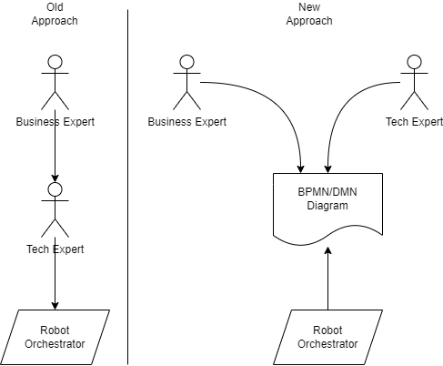
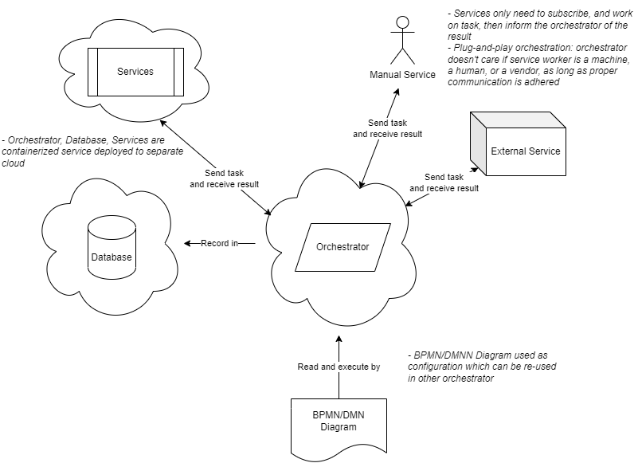
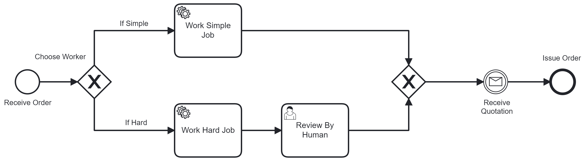
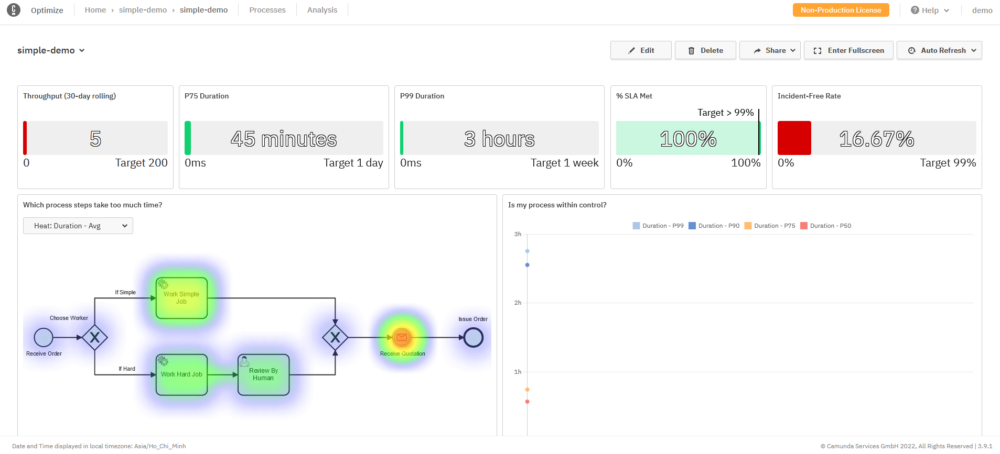
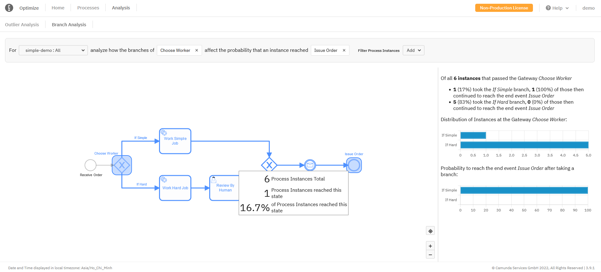

# Table of Content

1. [Problem](#problem)
2. [Solution](#solution)
3. [Benefit](#benefit)
4. [Hackathon Example](#hackathon-example)

# Problem

Software development is often a telephone game, where Business expert explains requirements to Tech, and Tech expert tries to implement it in the Machine language. For a simple software with well-defined goal and rarely-changed requirement, it's not a problem.

Now imagine trying to develop a solution to orchestrate and monitor end-to-end process. Business expert will need to somehow distill 50 pages of SOP into concrete requirements in plain English. Tech expert will then re-write the whole thing in code so that the Machine can execute. Business expert is the process owner, yet Tech expert is process architect. So in order to successfully implement a process, both must be in sync, which rarely is the case.

Also, once the project is completed, one quickly finds out that the orchestrated process is rarely transferable. There are 2 reasons: Business SOP rarely lock-steps with code implementation, and some knowledges are often implicit in the code (added followed ad-hoc requirement and failed to be documented). So if another function wishes to implement a similar process, it needs to have the old project team, or risk mis-implementing. This system is highly coupled. And highly coupled system is not easily modifiable or reusable.

# Solution

To facilitate understanding between Business, Tech, and Machine. And to maximize reusability of automated orchestrated process. I propose 2-pronged approaches

## 1. Processes as code

- Executable BPMN/DMN diagram as the common language between Business, Tech, and Machine:
  - BPMN/DMN standard is internationally recognized and used in many orchestration system
  - Business experts build their requirements in BPMN/DMN visual model diagram. They are now the architects of the process.
  - Machine (the Orchestrator) interpret and execute the BPMN/DMN model
  - Tech experts now only need to focus on writing glue service to link workers (automated or manual), and deploy appropriate infrastructure for the system.
  - Instead of the usual telephone game, the communication now looks like a star, with BPMN/DMN diagram in the middle
- The Machine Orchestrator (Camunda 8 in this example) will run any standard-compliant BPMN/DMN. Camunda 8 is self-contained and relies on BPMN/DMN to execute:
  - Business experts are functionally writing code to Orchestrator using diagram.
  - All requirements must be expressed, and no more sneaky implementation. If it's implemented, it's expressed as a visual component in the diagram.

## 2. Loosely-coupled microservices

- Orchestrator is self-contained service that needs only to read BPMN/DMN model, call Service Workers specified in the diagram, and record its history for audit later.
- Service Workers are responsible for actual work, and separated from Orchestrator:
  - Workers can be an external service, an internal call. It can be automated, manual, or just another child process.
  - Tech experts write glue service, and can re-use them for different Orchestrators
  - It can be easily packaged as a container, since BPMN/DMN process encourages writing decoupled service
- BPMN/DMN is just a configuration file, it can be easily version-controlled, packaged, modified, and deployed to any Orchestrator that can run BPMN/DMN (jBPM, Camunda, Activi ...)

# Benefit

Frictionless deployment of orchestrated processes opens many possibilities:

- Rapid identification of automation opportunities and development of such solution.
- It's now possible for Business experts to modify current processes without back-and-forth with Tech experts to re-implement.
- Encourage adoption of process orchestration, thus enable collecting and monitoring process metrics for further service optimization or hardening.
- Possibility to containerize, commoditize, and commercialize processes by either offering the executable BPMN/DMN diagram (which itself is a form of program), the service workers (which can do useful task for any Orchestrator), or both.

# Hackathon Example:

## Implementation

- Orchestrator: Camunda 8
  - Containers deployed on VM with `docker-compose` without writing any additional code
  - Come with application to monitor and optimize processes
- BPMN Diagram: Desktop Modeler ([download here](https://camunda.com/download/modeler/))
  - Simple diagram with automated task, human task, decision gateway

- Service Workers:
  - Subscribe to Zeebee cluster to control process and perform task
  - Deployed as NodeJS application on Azure App Service

## Sneak peek of end product

- Bird-eye view of overall processes. Identify bottleneck. Measure process failure and throughput:

Process Overview:

Branch Analysis:

